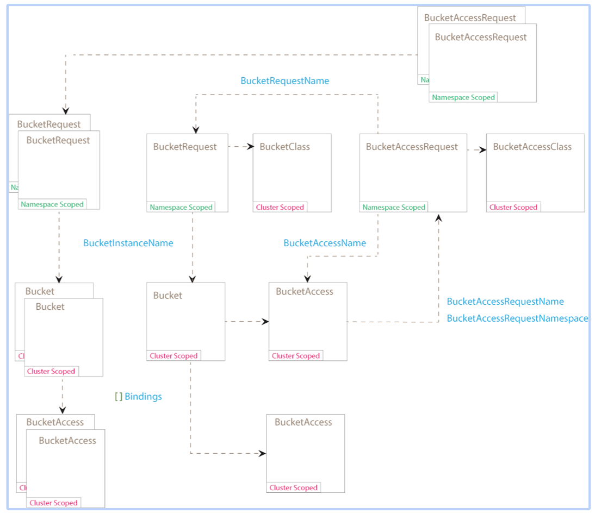

# Container Object Storage Interface (COSI)

Authors:

* Sidharth Mani [@wlan0](https://github.com/wlan0)
* Jeff Vance [@jeffvance](https://github.com/jeffvance)
* Srini Brahmaroutu [@brahmaroutu](https://github.com/brahmaroutu)


## Notational Conventions

The keywords "MUST", "MUST NOT", "REQUIRED", "SHALL", "SHALL NOT", "SHOULD", "SHOULD NOT", "RECOMMENDED", "NOT RECOMMENDED", "MAY", and "OPTIONAL" are to be interpreted as described in [RFC 2119](http://tools.ietf.org/html/rfc2119) (Bradner, S., "Key words for use in RFCs to Indicate Requirement Levels", BCP 14, RFC 2119, March 1997).

The key words "unspecified", "undefined", and "implementation-defined" are to be interpreted as described in the [rationale for the C99 standard](http://www.open-std.org/jtc1/sc22/wg14/www/C99RationaleV5.10.pdf#page=18).

An implementation is not compliant if it fails to satisfy one or more of the MUST, REQUIRED, or SHALL requirements for the protocols it implements.
An implementation is compliant if it satisfies all the MUST, REQUIRED, and SHALL requirements for the protocols it implements.

## Terminology

| Term              | Definition                                       |
|-------------------|--------------------------------------------------|
| Bucket            | A flat organization that contains immutable objects.                          |
| Brownfield Bucket | An existing back-end bucket.                        |
| Greenfield Bucket | A new back-end bucket created by COSI.                        |
|COSI  System              | Container Orchestration system/ Container Object Storage Implementation, communicates with Plugins using COSI service RPCs.                                     |
| SP                | Object Storage Provider, the vendor of a COSI plugin implementation.                                                          |
| CO                | Container Orchestrator, like Kubernetes.                                                          |
| RPC/gRPC               | [Remote Procedure Call](https://en.wikipedia.org/wiki/Remote_procedure_call).                                         |
| Node              | A host where the user workload will be running, uniquely identifiable from the perspective of a Plugin by a node ID. |
| COSI Driver(aka Plugin)           | Aka “plugin implementation”, a gRPC endpoint that implements the COSI Services.                                        |
| Sidecar (aka Provisioner Sidecar) | A COSI process that interfaces with the Plugin.                                                       |
|COSI Node Adapter (aka CSI Driver) | A process that accepts gRPC calls from the Kubelet notifying it when the workload has been started and when it is terminating. |
| Provisioner | A generic term meant to describe the combination of a sidecar and COSI driver. "Provisioning" a bucket can mean creating a new bucket or granting access to an existing bucket.                                                       |
| Workload          | The atomic unit of "work" scheduled by a COSI System. This MAY be a container or a collection of containers.                   |

## Objective

To define a standard “Container Object Storage Interface” (COSI) that enables a storage vendor (SP) to develop an RPC-based plugin once and have it work across multiple Kubernetes clusters and on other COs.

### Goals in MVP

The Container Object Storage Interface (COSI) will:

* Enable SP authors to write one COSI compliant RPC Plugin that “just works” across all COs that implement COSI.
* Define API (RPCs) that enable:
  * Dynamic provisioning and de-provisioning of a bucket.
  * Ability to define bucket access control mechanisms
  * Consumption of both existing and new buckets created on SP.
  * Define plugin protocol recommendations.
  * Describe a process by which an admin configures a Plugin.
  * COSI deployments and templates. 

### Non-Goals in MVP

The Container Object Storage Interface (COSI) spec explicitly will not define, provide, or dictate:

* Specific mechanisms by which a Provisioner Sidecar manages the lifecycle of a Plugin, including:
  * How to deploy, install, upgrade, uninstall, monitor, or respawn (in case of unexpected termination) Plugins.
* A first class message structure/field to represent "grades of object storage" (aka "bucket class").
* Protocol-level authentication and authorization.
* Packaging of a Plugin.

## Solution Overview

This specification defines an interface along with the minimum operational and packaging recommendations for a storage provider (SP) to implement a COSI compatible plugin.
The interface declares the RPCs that a plugin MUST expose: this is the **primary focus** of the COSI specification.
Any operational and packaging recommendations offer additional guidance to promote cross-COSI system compatibility.

### Architecture

The primary focus of this specification is on the RPC **protocol** between a COSI System and a Plugin.
It SHOULD be possible to ship cross-COSI system compatible Plugins for a variety of deployment architectures.
A COSI system SHOULD be equipped to handle both centralized and headless plugins.
Interaction of these components is illustrated in the  figure below.

```
                    COSI System "Master" Host
+-------------------------------------------+
|                                           |
|  +------------+           +------------+  |
|  |   COSI     |   gRPC    | Controller |  |
|  |   System   +----------->   Plugin   |  |
|  +------------+           +------------+  |
|                                           |
+-------------------------------------------+

```
Figure 1: Plugin deployment, all of the COSI system Node hosts run Plugins. 




Figure 2: Kubernetes implementation - Interaction of COSI components 

### Bucket Lifecycle

```
     CreateBucket +-------------+ DeleteBucket 
    +------------->|  CREATED   +--------------+ 
    |              +---+----^---+              |    
    |          Grant   |    | Revoke           v    
    +++        Bucket  |    | Bucket          +++  
    |X|        Access  |    | Access          | |  
    +-+            +---v----+---+             +-+  
                   |   BOUND    |                  
                   +---+----^---+                  

```
Figure 3: The lifecycle of a dynamically provisioned bucket, from
creation to deletion.

The above diagrams illustrate a general expectation with respect to how a COSI system MAY manage the lifecycle of a bucket via the API presented in this specification. 
Plugins SHOULD expose all RPCs for an interface: Controller plugins SHOULD implement all RPCs for the  service.
Unsupported RPCs SHOULD return an appropriate error code that indicates such (e.g. `UNIMPLEMENTED`).

## Container Object Storage Interface

This section describes the interface between COSI systems and Plugins.

### RPC Interface

A CO interacts with an Plugin through RPCs.
Each SP MUST provide:

* **Plugin**: A gRPC endpoint serving COSI RPCs that MUST be run on the Node.

```protobuf
syntax = "proto3";
package cosi.v1alpha1;

import "google/protobuf/descriptor.proto";

option go_package = "sigs.k8s.io/container-object-storage-interface-spec;cosi";

extend google.protobuf.EnumOptions {
    // Indicates that this enum is OPTIONAL and part of an experimental
    // API that may be deprecated and eventually removed between minor
    // releases.
    bool alpha_enum = 1116;
}

extend google.protobuf.EnumValueOptions {
    // Indicates that this enum value is OPTIONAL and part of an
    // experimental API that may be deprecated and eventually removed
    // between minor releases.
    bool alpha_enum_value = 1116;
}

extend google.protobuf.FieldOptions {
    // Indicates that a field MAY contain information that is sensitive
    // and MUST be treated as such (e.g. not logged).
    bool cosi_secret = 1115;

    // Indicates that this field is OPTIONAL and part of an experimental
    // API that may be deprecated and eventually removed between minor
    // releases.
    bool alpha_field = 1116;
}

extend google.protobuf.MessageOptions {
    // Indicates that this message is OPTIONAL and part of an experimental
    // API that may be deprecated and eventually removed between minor
    // releases.
    bool alpha_message = 1116;
}

extend google.protobuf.MethodOptions {
    // Indicates that this method is OPTIONAL and part of an experimental
    // API that may be deprecated and eventually removed between minor
    // releases.
    bool alpha_method = 1116;
}

extend google.protobuf.ServiceOptions {
    // Indicates that this service is OPTIONAL and part of an experimental
    // API that may be deprecated and eventually removed between minor
    // releases.
    bool alpha_service = 1116;
}

service Identity {
    // This call is meant to retrieve the unique provisioner Identity.
    // This identity will have to be set in BucketRequest.Provisioner field in order to invoke this specific provisioner.
    rpc ProvisionerGetInfo (ProvisionerGetInfoRequest) returns (ProvisionerGetInfoResponse) {}
}

service Provisioner {
    // This call is made to create the bucket in the backend.
    // This call is idempotent
    //    1. If a bucket that matches both name and parameters already exists, then OK (success) must be returned.
    //    2. If a bucket by same name, but different parameters is provided, then the appropriate error code ALREADY_EXISTS must be returned.
    rpc ProvisionerCreateBucket (ProvisionerCreateBucketRequest) returns (ProvisionerCreateBucketResponse) {}
    // This call is made to delete the bucket in the backend.
    // If the bucket has already been deleted, then no error should be returned.
    rpc ProvisionerDeleteBucket (ProvisionerDeleteBucketRequest) returns (ProvisionerDeleteBucketResponse) {}

    // This call grants access to an account. The account_name in the request shall be used as a unique identifier to create credentials.
    // The account_id returned in the response will be used as the unique identifier for deleting this access when calling ProvisionerRevokeBucketAccess.
    rpc ProvisionerGrantBucketAccess (ProvisionerGrantBucketAccessRequest) returns (ProvisionerGrantBucketAccessResponse);
    // This call revokes all access to a particular bucket from a principal.
    rpc ProvisionerRevokeBucketAccess (ProvisionerRevokeBucketAccessRequest) returns (ProvisionerRevokeBucketAccessResponse);
}

// S3SignatureVersion is the version of the signing algorithm for all s3 requests
enum S3SignatureVersion {
    UnknownSignature = 0;
    // S3V2, Signature version v2
    S3V2 = 1;
    // S3V4, Signature version v4
    S3V4 = 2;
}

enum AnonymousBucketAccessMode {
    UnknownBucketAccessMode = 0;
    // Default, disallow uncredentialed access to the backend storage.
    Private = 1;
    // Read only, uncredentialed users can call ListBucket and GetObject.
    ReadOnly = 2;
    // Write only, uncredentialed users can only call PutObject.
    WriteOnly = 3;
    // Read/Write, uncredentialed users can read objects as well as PutObject.
    ReadWrite = 4;
}

message S3 {
    // region denotes the geographical region where the S3 server is running
    string region = 1;
    // signature_version denotes the signature version for signing all s3 requests
    S3SignatureVersion signature_version = 2;
}

message AzureBlob {
    // storage_account is the id of the azure storage account
    string storage_account = 1;
}

message GCS {
    // private_key_name denotes the name of the private key in the storage backend
    string private_key_name = 1;
    // project_id denotes the name of the project id in the storage backend
    string project_id = 2;
    // service_account denotes the name of the service account in the storage backend
    string service_account = 3;
}

message Protocol {
    oneof type {
        S3 s3 = 1;
        AzureBlob azureBlob = 2;
        GCS gcs = 3;
    }
}

message ProvisionerGetInfoRequest {
    // Intentionally left blank
}

message ProvisionerGetInfoResponse {    
    // This field is REQUIRED
    // The name MUST follow domain name notation format
    // (https://tools.ietf.org/html/rfc1035#section-2.3.1). It SHOULD
    // include the plugin's host company name and the plugin name,
    // to minimize the possibility of collisions. It MUST be 63
    // characters or less, beginning and ending with an alphanumeric
    // character ([a-z0-9A-Z]) with dashes (-), dots (.), and
    // alphanumerics between.
    string name = 1;
}

message ProvisionerCreateBucketRequest {    
    // This field is REQUIRED
    // name specifies the name of the bucket that should be created.
    string name = 1;

    // This field is REQUIRED
    // Protocol specific information required by the call is passed in as key,value pairs.
    Protocol protocol = 2;

    // This field is OPTIONAL
    // The caller should treat the values in parameters as opaque. 
    // The receiver is responsible for parsing and validating the values.
    map<string,string> parameters = 3;
}

message ProvisionerCreateBucketResponse {
    // bucket_id returned here is expected to be the globally unique 
    // identifier for the bucket in the object storage provider 
    string bucket_id = 1;
}

message ProvisionerDeleteBucketRequest {
    // This field is REQUIRED
    // bucket_id is a globally unique identifier for the bucket
    // in the object storage provider 
    string bucket_id = 1;
}

message ProvisionerDeleteBucketResponse {
    // Intentionally left blank
}

message ProvisionerGrantBucketAccessRequest {
    // This field is REQUIRED
    // bucket_id is a globally unique identifier for the bucket
    // in the object storage provider 
    string bucket_id = 1;

    // This field is REQUIRED
    // account_name is a identifier for object storage provider 
    // to ensure that multiple requests for the same account
    // result in only one access token being created
    string account_name = 2;

    // This field is REQUIRED
    // Requested Access policy, ex: {"Effect":"Allow","Action":"s3:PutObject","Resource":"arn:aws:s3:::profilepics/*"}
    string access_policy = 3;

    // This field is OPTIONAL
    // The caller should treat the values in parameters as opaque. 
    // The receiver is responsible for parsing and validating the values.
    map<string,string> parameters = 4;
}

message ProvisionerGrantBucketAccessResponse {
    // This field is OPTIONAL
    // This is the account_id that is being provided access. This will
    // be required later to revoke access. 
    string account_id = 1;

    // This field is OPTIONAL
    // Credentials supplied for accessing the bucket ex: aws access key id and secret, etc.
    string credentials = 2;
}

message ProvisionerRevokeBucketAccessRequest {
    // This field is REQUIRED
    // bucket_id is a globally unique identifier for the bucket
    // in the object storage provider.
    string bucket_id = 1;

    // This field is REQUIRED
    // This is the account_id that is having its access revoked.
    string account_id = 2;
}

message ProvisionerRevokeBucketAccessResponse {
    // Intentionally left blank
}

```

#### Concurrency

In general the Cluster Orchestrator (CO) is responsible for ensuring that there is no more than one call “in-flight” per Bucket at a given time.
Multiple calls to CreateBucket may result in error 'ALREADY_EXISTS' if the call succeeded early. Similarly DeleteBucket, GrantBucketAccess, RevokeBucketAccess will behave the same.


#### Field Requirements

The requirements documented herein apply equally and without exception, unless otherwise noted, for the fields of all protobuf message types defined by this specification.
Violation of these requirements MAY result in RPC message data that is not compatible with all COSI systems, Plugin, and/or COSI middleware implementations.

##### Size Limits

COSI defines general size limits for fields of various types (see table below).
The general size limit for a particular field MAY be overridden by specifying a different size limit in said field's description.
Unless otherwise specified, fields SHALL NOT exceed the limits documented here.
These limits apply for messages generated by both COSI systems and plugins.

| Size       | Field Type          |
|------------|---------------------|
| 128 bytes  | string              |
| 4 KiB      | map<string, string> |

##### `REQUIRED` vs. `OPTIONAL`

* A field noted as `REQUIRED` MUST be specified, subject to any per-RPC caveats; caveats SHOULD be rare.
* A `repeated` or `map` field listed as `REQUIRED` MUST contain at least 1 element.
* A field noted as `OPTIONAL` MAY be specified and the specification SHALL clearly define expected behavior for the default, zero-value of such fields.

Scalar fields, even REQUIRED ones, will be defaulted if not specified and any field set to the default value will not be serialized over the wire as per [proto3](https://developers.google.com/protocol-buffers/docs/proto3#default).

#### Timeouts

Any of the RPCs defined in this spec MAY timeout and MAY be retried.
The COSI system MAY choose the maximum time it is willing to wait for a call, how long it waits between retries, and how many time it retries (these values are not negotiated between plugin and COSI system).

Idempotency requirements ensure that a retried call with the same fields continues where it left off when retried.
The only way to cancel a call is to issue a "negation" call if one exists.
For example, issue a `DeleteBucket` call to cancel a pending `CreateBucket` operation, etc.

### Error Scheme

All COSI API calls defined in this spec MUST return a [standard gRPC status](https://github.com/grpc/grpc/blob/master/src/proto/grpc/status/status.proto).
Most gRPC libraries provide helper methods to set and read the status fields.

The status `code` MUST contain a [canonical error code](https://github.com/grpc/grpc-go/blob/master/codes/codes.go). COSI systems MUST handle all valid error codes. Each RPC defines a set of gRPC error codes that MUST be returned by the plugin when specified conditions are encountered. In addition to those, if the conditions defined below are encountered, the plugin MUST return the associated gRPC error code.

| Condition | gRPC Code | Description | Recovery Behavior |
|-----------|-----------|-------------|-------------------|
| Missing required field | 3 MISSING_ARGUMENT | Indicates that a required field is missing from the request. More human-readable information MAY be provided in the `status.message` field. | Caller MUST fix the request by adding the missing required field before retrying. |
| Invalid or unsupported field in the request | 3 INVALID_ARGUMENT | Indicates that the one or more fields in this field is either not allowed by the Plugin or has an invalid value. More human-readable information MAY be provided in the gRPC `status.message` field. | Caller MUST fix the field before retrying. |
| Permission denied | 7 PERMISSION_DENIED | The Plugin is able to derive or otherwise infer an identity from the secrets present within an RPC, but that identity does not have permission to invoke the RPC. | System administrator SHOULD ensure that requisite permissions are granted, after which point the caller MAY retry the attempted RPC. |
| Operation pending for bucket | 10 ABORTED | Indicates that there is already an operation pending for the specified bucket. In general the Cluster Orchestrator (CO) is responsible for ensuring that there is no more than one call "in-flight" per bucket at a given time. However, in some circumstances, the COSI system MAY lose state (for example when the COSI system crashes and restarts), and MAY issue multiple calls simultaneously for the same bucket. The Plugin, SHOULD handle this as gracefully as possible, and MAY return this error code to reject secondary calls. | Caller SHOULD ensure that there are no other calls pending for the specified volume, and then retry with exponential back off. |
| Call not implemented | 12 UNIMPLEMENTED | The invoked RPC is not implemented by the Plugin or disabled in the Plugin's current mode of operation. | Caller MUST NOT retry. Caller MAY call `GetPluginInfo` to discover Plugin info. |
| Not authenticated | 16 UNAUTHENTICATED | The invoked RPC does not carry secrets that are valid for authentication. | Caller SHALL either fix the secrets provided in the RPC, or otherwise regalvanize said secrets such that they will pass authentication by the Plugin for the attempted RPC, after which point the caller MAY retry the attempted RPC. |

The status `message` MUST contain a human readable description of error, if the status `code` is not `OK`.
This string MAY be surfaced by COSI system to end users.

The status `details` MUST be empty. In the future, this spec MAY require `details` to return a machine-parsable protobuf message if the status `code` is not `OK` to enable COSI system's to implement smarter error handling and fault resolution.

### Provisioner Service RPC

Provisioner service RPCs allow a COSI system to query a plugin for information, create and delete bucket as well as grant and revoke access to the bucket to various principals running the workload.
The general flow of the success case MAY be as follows (protos illustrated in YAML for brevity):

1. COSI system queries metadata via Identity RPC.

```
   # COSI system --(ProvisionerGetInfo)--> Plugin
   request:
   response:
      name: org.foo.whizbang.super-plugin
      version: blue-green
      manifest:
        baz: qaz
```
```
message ProvisionerGetInfoRequest {
    // Intentionally left blank
}

message ProvisionerGetInfoResponse {    
    string name = 1;
    string version = 2;
    map<string,string> manifest = 3;
}
```

#### `ProvisionerCreateBucket`

A Controller Plugin MUST implement this RPC call.
This RPC will be called by the COSI system to provision a new bucket on behalf of a COSI user.

This operation MUST be idempotent.
If a volume corresponding to the specified bucket `name` already exists, is accessible from `accessibility_requirements, and is compatible with the specified attributes of the bucket in the `ProvisionerCreateBucket`, the Plugin MUST reply `0 OK` with the corresponding `ProvisionerCreateBucketResponse`.

```
message ProvisionerCreateBucketRequest {  
    // Idempotency - This name is generated by the COSI system to achieve
    // idempotency.  
    // This field is REQUIRED.
    string bucket_name = 1;

    // This field is OPTIONAL
    // Protocol specific information required by the call is passed in as key,value pairs.
    map<string,string> bucket_context = 2;
}

message ProvisionerCreateBucketResponse {
    // Intentionally left blank
}

```
##### CreateBucket Errors

If the plugin is unable to complete the CreateBucket call successfully, it MUST return a non-ok gRPC code in the gRPC status.
If the conditions defined below are encountered, the plugin MUST return the specified gRPC error code.
The COSI system MUST implement the specified error recovery behavior when it encounters the gRPC error code.

| Condition | gRPC Code | Description | Recovery Behavior |
|-----------|-----------|-------------|-------------------|
| Bucket Name invalid | 3 INVALID_ARGUMENT | Besides the general cases, this code MUST also be used to indicate when plugin cannot create a bucket due to parameter check on the backend. More human-readable information SHOULD be provided in the gRPC `status.message` field for the problem. | Caller should retry call with corrected parameter values.|
| Bucket already exists but is incompatible | 6 ALREADY_EXISTS | Indicates that a bucket corresponding to the specified bucket `name` already exists but is incompatible with the specified attributes. | Caller MUST fix the arguments or use a different `name` before retrying. |
| Unsupported value | 11 OUT_OF_RANGE | Indicates that the value requested cannot be used to provision the bucket. | Caller MUST fix the attributes before retrying. |


### Secrets Requirements (where applicable)

Secrets MAY be required by plugin to complete a RPC request.
A secret is a string to string map where the key identifies the name of the secret (e.g. "username" or "password"), and the value contains the secret data (e.g. "bob" or "abc123").
Each key MUST consist of alphanumeric characters, '-', '_' or '.'.
Each value MUST contain a valid string.
An SP MAY choose to accept binary (non-string) data by using a binary-to-text encoding scheme, like base64.
An SP SHALL advertise the requirements for required secret keys and values in documentation.
COSI system SHALL permit passing through the required secrets.
A COSI system MAY pass the same secrets to all RPCs, therefore the keys for all unique secrets that an SP expects MUST be unique across all COSI operations.
This information is sensitive and MUST be treated as such (not logged, etc.) by the COSI system.


## Protocol

### Connectivity

* A COSI system SHALL communicate with a Plugin using gRPC to access the `Provisioner` service.
  * proto3 SHOULD be used with gRPC, as per the [official recommendations](http://www.grpc.io/docs/guides/#protocol-buffer-versions).
  * All Plugins SHALL implement the REQUIRED Identity service RPCs.
* The COSI system SHALL provide the listen-address for the Plugin by way of the `COSI_ENDPOINT` environment variable.
  Plugin components SHALL create, bind, and listen for RPCs on the specified listen address.
  * Only UNIX Domain Sockets MAY be used as endpoints.
    This will likely change in a future version of this specification to support non-UNIX platforms.
* All supported RPC services MUST be available at the listen address of the Plugin.

### Security

* The COSI system operator and Provisioner Sidecar SHOULD take steps to ensure that any and all communication between the COSI system and Plugin Service are secured according to best practices.
* Communication between a COSI system and a Plugin SHALL be transported over UNIX Domain Sockets.
  * gRPC is compatible with UNIX Domain Sockets; it is the responsibility of the COSI system operator and Provisioner Sidecar to properly secure access to the Domain Socket using OS filesystem ACLs and/or other OS-specific security context tooling.
  * SP’s supplying stand-alone Plugin controller appliances, or other remote components that are incompatible with UNIX Domain Sockets MUST provide a software component that proxies communication between a UNIX Domain Socket and the remote component(s).
    Proxy components transporting communication over IP networks SHALL be responsible for securing communications over such networks.
* Both the COSI system and Plugin SHOULD avoid accidental leakage of sensitive information (such as redacting such information from log files).

### Debugging

* Debugging and tracing are supported by external, COSI-independent additions and extensions to gRPC APIs, such as [OpenTracing](https://github.com/grpc-ecosystem/grpc-opentracing).

## Configuration and Operation

### General Configuration

* The `COSI_ENDPOINT` environment variable SHALL be supplied to the Plugin by the Provisioner Sidecar.
* An operator SHALL configure the COSI system to connect to the Plugin via the listen address identified by `COSI_ENDPOINT` variable.
* With exception to sensitive data, Plugin configuration SHOULD be specified by environment variables, whenever possible, instead of by command line flags or bind-mounted/injected files.


#### Plugin Bootstrap Example

* Sidecar -> Plugin: `COSI_ENDPOINT=unix:///path/to/unix/domain/socket.sock`.
* Operator -> COSI system: use plugin at endpoint `unix:///path/to/unix/domain/socket.sock`.
* COSI system: monitor `/path/to/unix/domain/socket.sock`.
* Plugin: read `COSI_ENDPOINT`, create UNIX socket at specified path, bind and listen.
* COSI system: observe that socket now exists, establish connection.
* COSI system: invoke `GetPluginInfo.

#### Filesystem

* Plugins SHALL NOT specify requirements that include or otherwise reference directories and/or files on the root filesystem of the COSI system.
* Plugins SHALL NOT create additional files or directories adjacent to the UNIX socket specified by `COSI_ENDPOINT`; violations of this requirement constitute "abuse".
  * The Provisioner Sidecar is the ultimate authority of the directory in which the UNIX socket endpoint is created and MAY enforce policies to prevent and/or mitigate abuse of the directory by Plugins.

### Supervised Lifecycle Management

* For Plugins packaged in software form:
  * Plugin Packages SHOULD use a well-documented container image format (e.g., Docker, OCI).
  * The chosen package image format MAY expose configurable Plugin properties as environment variables, unless otherwise indicated in the section below.
    Variables so exposed SHOULD be assigned default values in the image manifest.
  * A Provisioner Sidecar MAY programmatically evaluate or otherwise scan a Plugin Package’s image manifest in order to discover configurable environment variables.
  * A Plugin SHALL NOT assume that an operator or Provisioner Sidecar will scan an image manifest for environment variables.

#### Environment Variables

* Variables defined by this specification SHALL be identifiable by their `COSI_` name prefix.
* Configuration properties not defined by the COSI specification SHALL NOT use the same `COSI_` name prefix; this prefix is reserved for common configuration properties defined by the COSI specification.
* The Provisioner Sidecar SHOULD supply all RECOMMENDED COSI environment variables to a Plugin.
* The Provisioner Sidecar SHALL supply all REQUIRED COSI environment variables to a Plugin.

##### `COSI_ENDPOINT`

Network endpoint at which a Plugin SHALL host COSI RPC services. The general format is:

    {scheme}://{authority}{endpoint}

The following address types SHALL be supported by Plugins:

    unix:///path/to/unix/socket.sock

Note: All UNIX endpoints SHALL end with `.sock`. See [gRPC Name Resolution](https://github.com/grpc/grpc/blob/master/doc/naming.md).

This variable is REQUIRED.

#### Operational Recommendations

The Provisioner Sidecar expects that a Plugin SHALL act as a long-running service vs. an on-demand, CLI-driven process.

Supervised plugins MAY be isolated and/or resource-bounded.

##### Logging

* Plugins SHOULD generate log messages to ONLY standard output and/or standard error.
  * In this case the Provisioner Sidecar SHALL assume responsibility for all log lifecycle management.
* Plugin implementations that deviate from the above recommendation SHALL clearly and unambiguously document the following:
  * Logging configuration flags and/or variables, including working sample configurations.
  * Default log destination(s) (where do the logs go if no configuration is specified?)
  * Log lifecycle management ownership and related guidance (size limits, rate limits, rolling, archiving, expunging, etc.) applicable to the logging mechanism embedded within the Plugin.
* Plugins SHOULD NOT write potentially sensitive data to logs (e.g. secrets).

##### Available Services

* Plugin Packages MAY support all or a subset of COSI services; service combinations MAY be configurable at runtime by the Provisioner Sidecar.
  * A plugin MUST know the "mode" in which it is operating (e.g. node, controller, or both).
  * This specification does not dictate the mechanism by which mode of operation MUST be discovered, and instead places that burden upon the SP.
* Misconfigured plugin software SHOULD fail-fast with an OS-appropriate error code.

##### Linux Capabilities

* Provisioner Sidecar SHALL guarantee that plugins will have necessary permission to connect to their backend Object Storage System 
* Plugins SHOULD clearly document any additionally required capabilities and/or security context.

##### Namespaces

* A Plugin SHOULD NOT assume that it is in the same [Linux namespaces](https://en.wikipedia.org/wiki/Linux_namespaces) as the Provisioner Sidecar.
  The COSI system MUST clearly document the CSI dependency requirements on ephemeral volumes for the plugins and the Provisioner Sidecar SHALL satisfy the COSI system’s requirements.

##### Cgroup Isolation

* A Plugin MAY be constrained by cgroups.
* An operator or Provisioner Sidecar MAY configure the devices cgroup subsystem to ensure that a Plugin MAY access requisite devices.
* A Provisioner Sidecar MAY define resource limits for a Plugin.

##### Resource Requirements

* SPs SHOULD unambiguously document all of a Plugin’s resource requirements.
